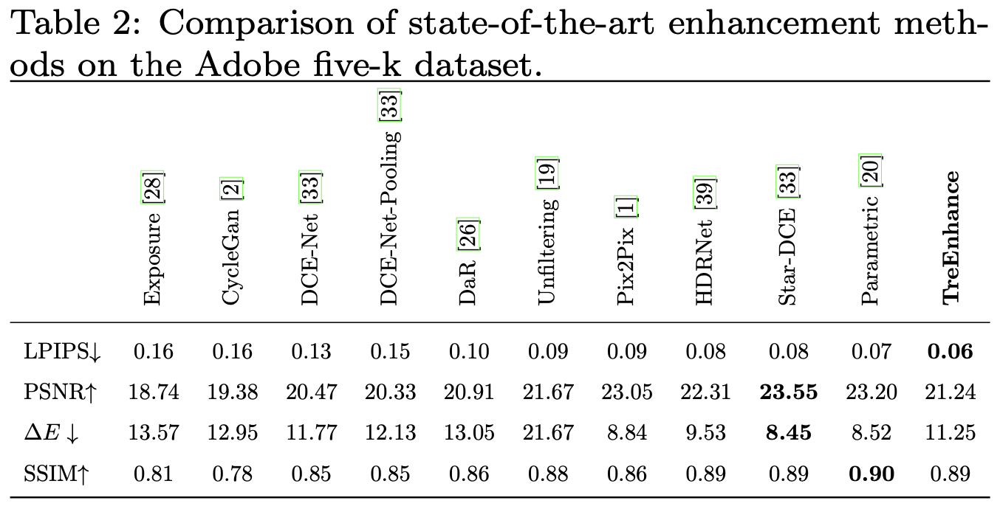

# TreEnhance: A tree search method for low-light image enhancement

Official Repo of the paper "TreEnhance:  A Tree Search Method For Low-Light Image Enhancement" published in **Pattern Recognition** Journal

[Marco Cotogni](https://scholar.google.com/citations?user=8PUz5lAAAAAJ&hl=it) and [Claudio Cusano](https://scholar.google.com/citations?hl=it&user=lhZpU_8AAAAJ&view_op=list_works&sortby=pubdate)

[](https://arxiv.org/pdf/2205.12639.pdf) [](https://www.sciencedirect.com/science/article/abs/pii/S0031320322007282?via%3Dihub)

TreEnhance is an automatic method for low-light image enhancement, capable of improving the quality of digital images. It combines tree search theory and deep reinforcement learning to produce high-quality enhanced images.

The method has two main phases during training:

- Generation phase: A modified version of Monte Carlo Tree Search (MCTS) algorithm is used to explore the space of image editing operations and select the most promising sequence.
- Optimization phase: The parameters of a neural network, implementing the enhancement policy, are updated.

Two different inference solutions are proposed for the enhancement of new images:

- MCTS-based: This solution is more accurate but takes more time and memory.
- Policy-based: This solution directly applies the learned policy and is faster but slightly less precise.

The method also has a guided search strategy that "reverses" the enhancement procedure applied to a given input image. Unlike other methods, TreEnhance does not pose any constraint on the image resolution and can be used in a variety of scenarios with minimal tuning.

The method was tested on two datasets: the Low-Light dataset and the Adobe Five-K dataset, and obtained good results both qualitatively and quantitatively.

<p align="center">

<br/>

</p>

## Requirements
python > 3.7, Pytorch, Torchvision, PIL, numpy

## Datasets
Download the [LOL](https://daooshee.github.io/BMVC2018website/) and [Five-K](https://data.csail.mit.edu/graphics/fivek/) datasets.

### LOL Datasets 
Split the data into train and test folders in according to the original papers.

### Five-K
Once the dataset has been downloaded, split the data in training (4000) and test(1000) using the files train1+2-list.txt and test-list.txt

## Reproducing the Experiments

In order to reproduce our experiments run the command

```
python3 training.py
```
to train the model and
```
python3 evaluation.py
```
to test the model and generate the images.


### Parameter Explanation

- basedir: This parameter specifies the base directory for the run.
- expname: This parameter sets the name of the run.
- dropout: This parameter sets the dropout rate applied to the neural model.
- num_images: This parameter sets the number of images to be used in each generation phase. At each generation, the images are sampled randomly.
- num_steps: This parameter sets the number of MCTS steps. The default value is 1000.
- val_images: This parameter sets the number of images to be used for validation.
- lr: This parameter sets the learning rate.
- size: This parameter sets the image size.
- num_gen: This parameter sets the number of generations phases.
- bs: This parameter sets the batch size, which determines the number of samples used in one iteration of the optimization phase.
- lambd: This parameter sets the value of lambda in the loss function.
- loops: This parameter sets the number of optimization loops to be performed.
- exploration:  This parameter sets the exploration coefficient.


## Results

### Quantitative results
<p float="left">
  
  
</p>

### Qualitative results
<p float="left">
  
  
</p>

## Reference
If you are considering using our code, or you want to cite our paper please use:

```
@article{cotogni2022treenhance,
  title={TreEnhance: A Tree Search Method For Low-Light Image Enhancement},
  author={Cotogni, Marco and Cusano, Claudio},
  journal={Pattern Recognition},
  pages={109249},
  year={2022},
  publisher={Elsevier}
}
```

